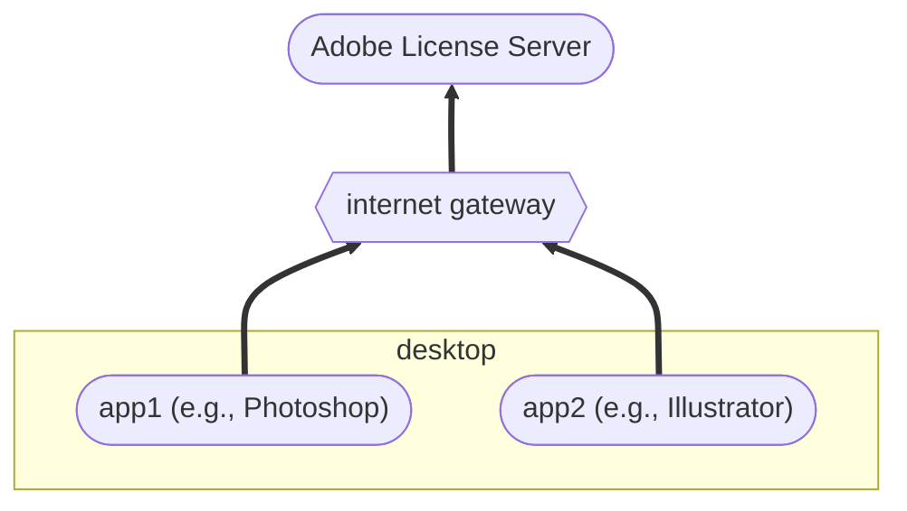
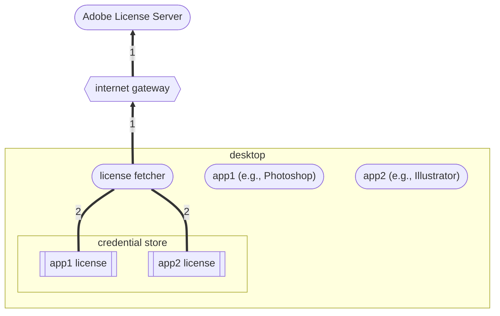
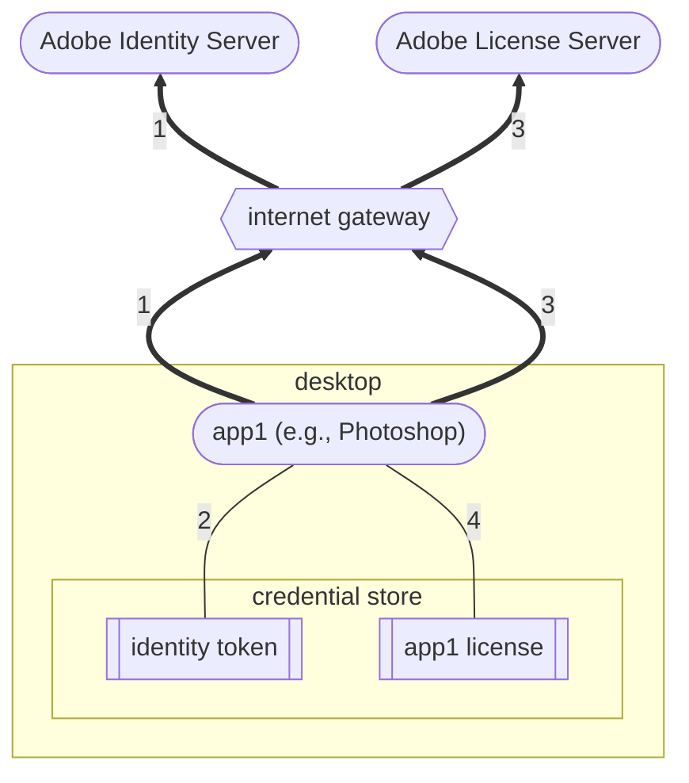
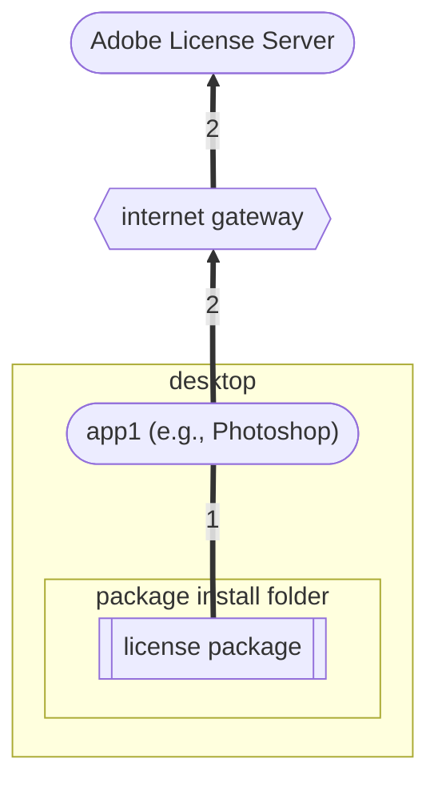
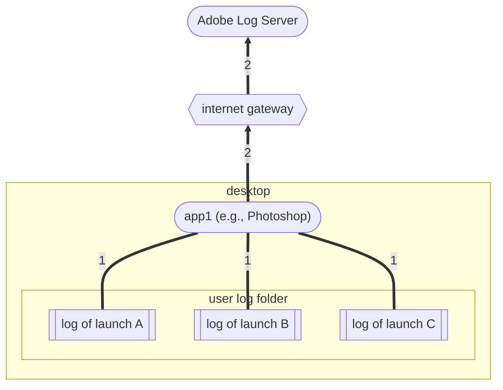

# Adobe Licensing and Logging

In order to use the ADLU effectively, you have to have a basic understanding of how the licensing and logging mechanisms in Adobe desktop software work.

## Launch-time licensing

The behavior of every Adobe desktop application is controlled by servers at Adobe.  The simplest version of how this works looks like this:

When each desktop app launches, it makes a call to the Adobe License Server at `https://lcs-cops.adobe.io`, the response to which is its behavioral instructions for that launch: run with all features, warn of trial expiration, give access to free but not paid features, etc.  These behavioral instructions are encapsulated in an Adobe-signed JSON data structure called a *license profile* or, more simply, a *license*.

Each time a desktop application receives a license, it saves it in the desktop OS credential store, so it can be used to control the behavior of future application launches.  These *cached licenses* are what allow applications to be used when they cannot contact the Adobe License Server; for example, when the desktop is offline or the Adobe License Server is down.

## Pre-launch licensing

When there are multiple applications installed on a single desktop, it can be more convenient for users to fetch license profiles for all the apps before any of them are launched, as in this diagram:

Once the fetcher has done its work, the desktop can then be taken off the internet.  The apps, at launch, will find their cached licenses in the credential store, and will behave as if they had reached the Adobe License Server themselves.

## Named-user licensing

When using named-user licensing, licenses for applications are associated with the user who is running the app.  Users must sign in before their apps can retrieve their license, and when they do an identity token is saved in the OS credential store.  Then, when apps launch, they pass the identity token to the Adobe License Server with the license request.

Since identity tokens are persisted, multiple apps can be launched multiple times for the same user using the same identity token.  Typically, it is a license fetching app such as the Creative Cloud Desktop that does the sign-in and storage of the identity token.

## Feature-restricted licensing

When using feature-restricted licensing, licenses for applications are associated with _license packages_ that are files created and downloaded by administrators.  Admins must install the license package on the desktop before the application is launched, and the package identification is passed to the Adobe License Server with the license request.

Administrators can create license packages which contain licenses for multiple applications.  When these packages are installed, however, each individual app's license ID is put into the package install folder in a separate file.  So installing a license package which licenses three applications will result in the package install folder containing three license ID files.

On Windows, the package install folder is `%CSIDL_COMMON_APPDATA%\Adobe\OperatingConfigs`, and on Mac it is `/Library/Application Support/Adobe/OperatingConfigs`.

## License Logging

Every desktop application keeps a log of its licensing activities: license requests to the server, sign-ins and sign-outs, workflows displayed to the user regarding trial expiration, and so on.  Logs from each launch are kept in a separate file in an `NGL` folder in the user-specific log directory.  The name of the file starts with the word `NGLClient` followed by a form of the application name and internal version number.  Files from prior launches are given launch dates as suffixes.

Part of the application behavior controlled by the Adobe License Server is the frequency with which these logs are uploaded to an Adobe Log Server (`https://lcs-ulecs.adobe.io`). In named-user licensing, logs from prior launches are uploaded whenever they reach 1MB in total size.  In feature-restricted licensing, logs are never uploaded.  The overall picture looks like this:

