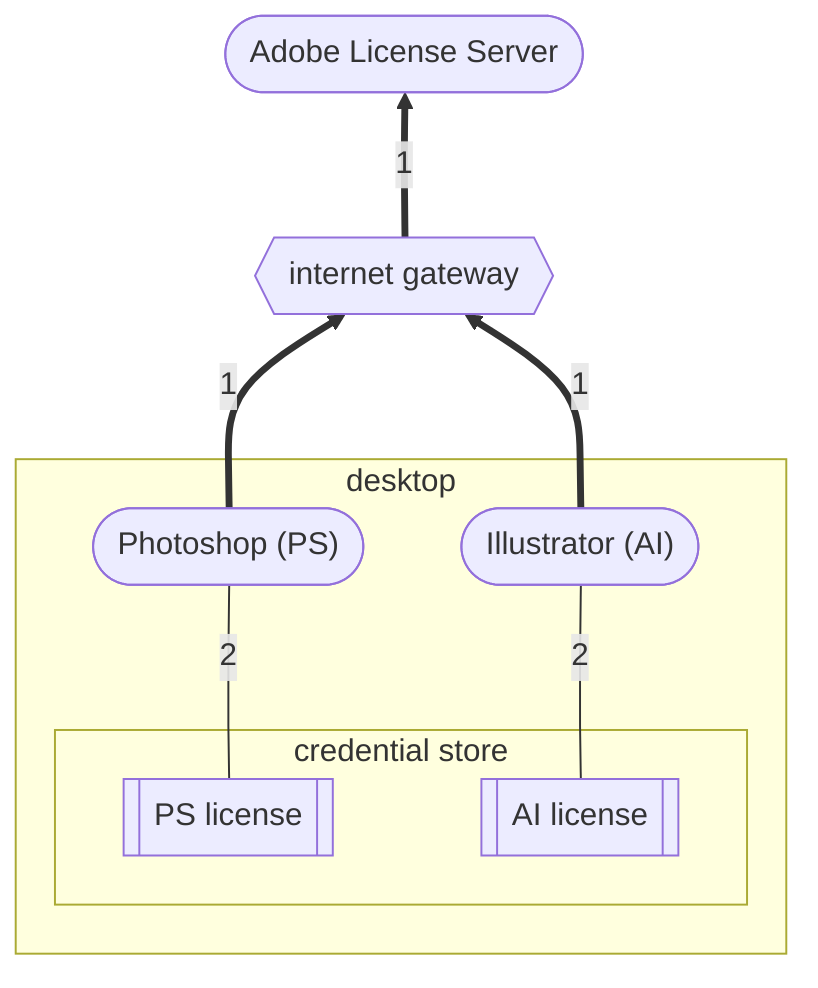
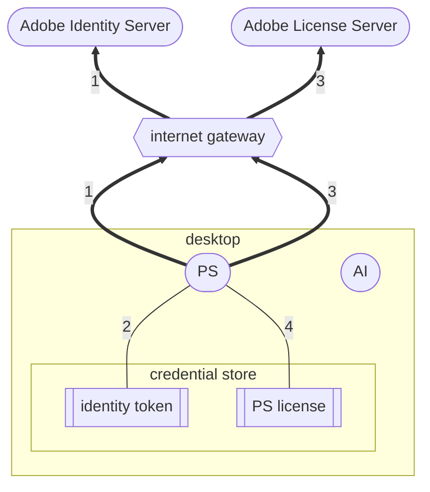
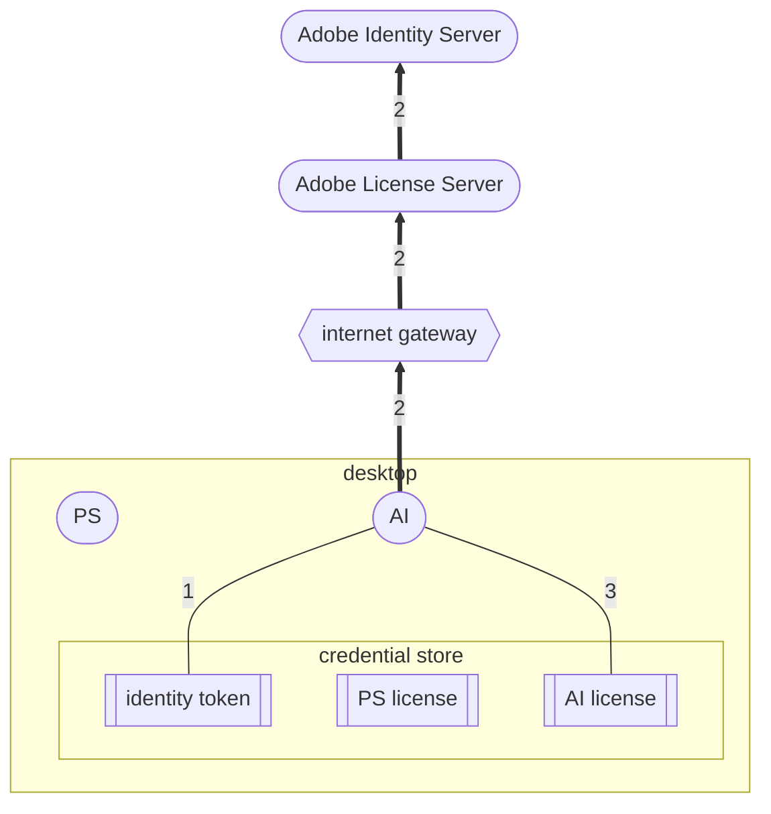
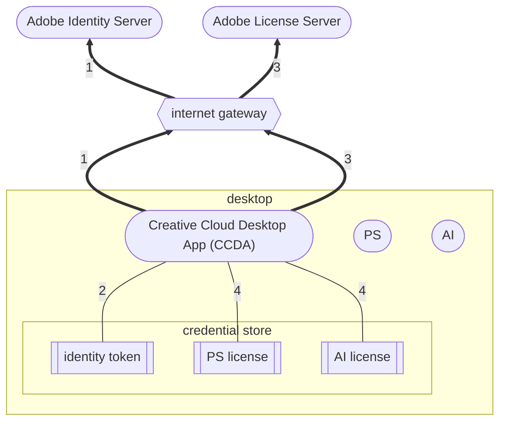
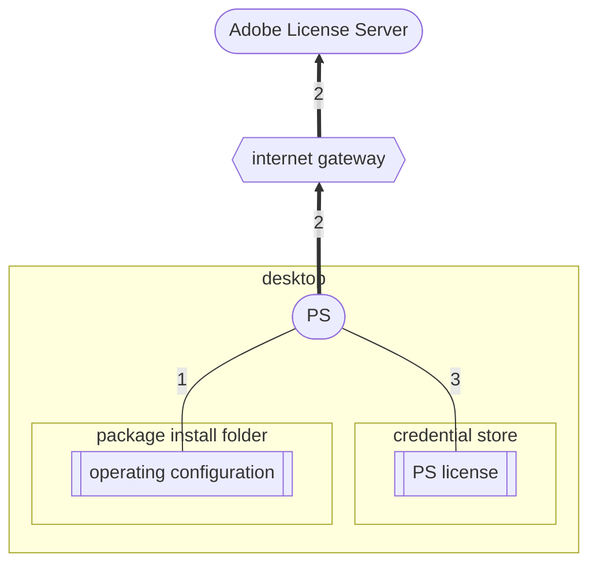
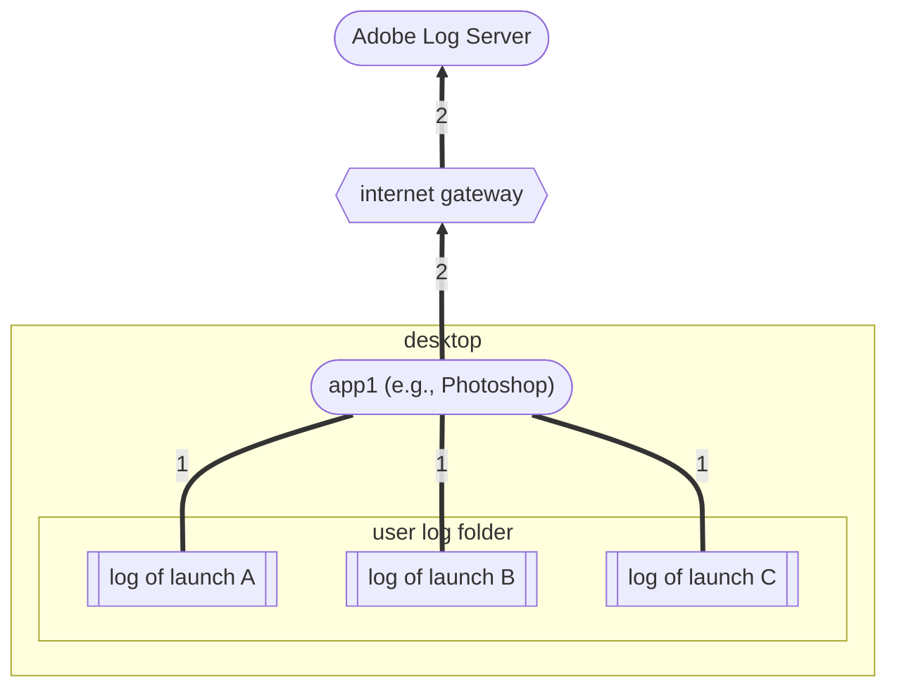

# Adobe Desktop Licensing: a Primer

In order to use the ADLU effectively, you have to have a basic understanding of how the licensing  mechanisms in Adobe desktop software work.  This primer provides that without diving into a lot of technical detail.  Readers who want more specifics can find them by looking up the various terms used here in the [accompanying glossary](./glossary.md).

## Launch-time licensing

The behavior of every Adobe desktop application is controlled by servers at Adobe.  The simplest version of how this works looks like this:

When each desktop app launches, it makes a call to the Adobe License Server, the response to which contains its behavioral instructions for that launch.  Examples of these instructions are “ok to run with all features,” “ok to run but warn of trial expiration,” and “subscription has expired, so offer renewal and quit if the user refuses.” These behavioral instructions are called a *license profile* or, more simply, a *license*.

Each time a desktop application receives a license from Adobe, it saves it in the desktop OS credential store, so it can be used to control the behavior of future application launches.  These *cached licenses* are what allow applications to be used when they cannot contact the Adobe License Server; for example, when the desktop is offline or the Adobe License Server is down.  They remain valid for a period of time that’s determined by the term of the customer’s contract for that application.

## Named-user licensing

When using named-user licensing (NUL), licenses for applications are associated with the user who is running the app.  Users must sign in before their apps can retrieve their license, and when they do an identity token is saved in the OS credential store.  Then, when apps launch, they pass the identity token to the Adobe License Server with the license request.  Both the sign-in and the license fetch can be done from within the app, as depicted here:

Once a user has logged in from one app, their identity token can be used by other apps on the same desktop to fetch their license without contacting the license server again, as in this diagram:

Notice that, when one app uses the identity token stored by another app, the Adobe License Server will verify the token used with the Adobe Identity Server to make sure it’s still valid (that is, the user account is still logged in).  In named-user licensing, every license is tied to an identity token, and stops being valid as soon as that identity token expires (even if the customer contract has not expired).

## Pre-launch named-user licensing

When there are multiple applications installed on a single desktop, it can be more convenient for users to sign in and fetch license profiles for all their apps before any of them are launched, as in this diagram:

Once the Creative Cloud Desktop Application has done its work, the desktop can then be taken off the internet.  The apps, at launch, will find their identity token and matching pre-fetched licenses in the credential store, and will behave as if they had reached the Adobe License Server themselves.

There is one subtle difference between pre-fetched licenses (obtained by CCDA) and cached licenses (obtained by the apps themselves): pre-fetched licenses do not count against a user’s activation limit.  This allows users to sign in using CCDA on any number of machines, and to use web-only services (such as CC Express or Stock Photos) on all those machines.  But when the users launch applications on those machines (while online), their applications will contact the Adobe License Server and request a license they can cache.  When that happens the license server will count the machine as activated, and the user may be required to deactivate one of the other machines (which will log it out). 

## Feature-restricted licensing

When using [feature-restricted licensing](./glossary.md#feature-restricted-licensing), licenses for applications are associated with [operating configurations](./glossary.md/#operating-configuration) that are installed by administrators. (To install the operating configuration, the administrator first creates a [license-only](./glossary.md#license-only-package) or [combination package](./glossary.md#combined-package) containing the operating configurations, and then installs that package on the desktop.) When an application launches, it passes the operating configuration data to the Adobe License Server with the license request, and the server looks up the associated package to find the appropriate [license profile](./glossary.md#license-profile).  Once the application server receives the license profile, it is stored in the [OS credential store](./glossary.md#os-credential-store).

The package install folder is an administrative object accessible to all the OS users of a single desktop.  But cached licenses (which are what allow offline use) are stored in the per-OS-user credential store, so OS user A and OS user B have separate cached licenses for the same application.  This means that, even in feature-restricted licensing, each OS user of a feature-restricted licensing must first launch each app while they are online, so they can get each get their own cached license in their own OS user account.  Only then can the users operate their apps while offline.

## License Logging

Every desktop application keeps a log of its licensing activities: license requests to the server, sign-ins and sign-outs, workflows displayed to the user regarding trial expiration, and so on.  Part of the application behavior controlled by the Adobe License Server is the frequency with which these logs are uploaded to an Adobe Log Server. In named-user licensing, logs from prior launches are uploaded whenever they reach 1MB in total size.  In feature-restricted licensing, logs are never uploaded.  The overall picture looks like this:

