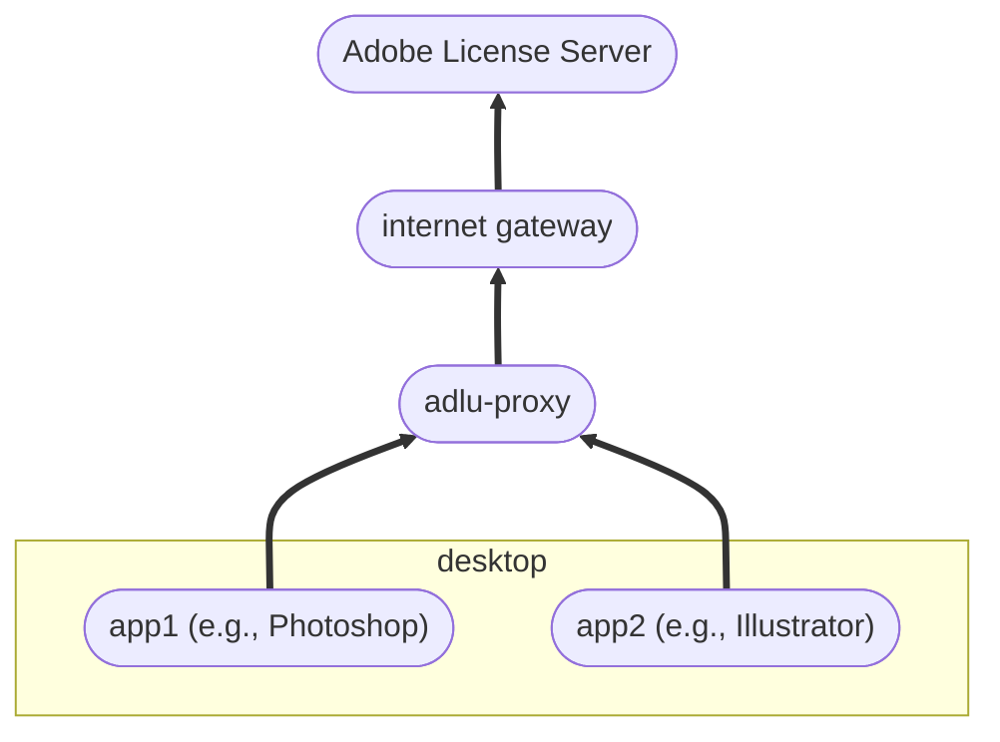

# ADLU Proxy Overview

The ADLU includes a web service, `adlu-proxy`, that is meant to be deployed on a customer-controlled server.  This document gives an overview of the proxy’s behavior and how it can be used effectively in various customer situations.

## Proxy characteristics

The ADLU proxy is a protocol-aware, caching, store-forward, reverse proxy server for both the Adobe License Server and the Adobe Log Server.  That’s a lot of adjectives in front of the word proxy; let’s consider each of them in turn.

### Reverse

A *reverse* proxy server is a proxy server that pretends to be another server (called the _origin_ server).  Clients who ask for the origin server’s IP address are given the proxy’s IP address instead.  When a reverse proxy server receives a client request, it passes the request on to the origin server and returns the origin server’s response to the client.  This behavior allows both clients and origin servers to be protected from snooping. The proxy can hide sensitive client details from being passed to the origin server, and it can hide origin server details from being passed to the client.

The `adlu-proxy` can act as a reverse proxy for either the Adobe License Server, the Adobe Log Server, or both at the same time.  It is meant to be deployed on the customer side of an internet gateway; that is, inside the customer local-area or corporate-area network.  Referring to the [simplest scenario in the Adobe Licensing Overview](./licensing-and-logging-overview.md#launch-time-licensing), the proxy would be positioned as follows:

In the case of feature-restricted licensing, this interposition of the ADLU proxy between clients and the Adobe License Server can be done without DNS or certificate manipulation, because an FRL package can be prepared that tells clients to use the ADLU proxy for licensing rather than Adobe’s servers.  In the case of named-user licensing, however, as well as license logging, the customer will have to use DNS controls and locally-trusted certificate authorities to get clients to make secure connections to the ADLU proxy rather than the Adobe server endpoints.

## Deployment Scenarios

### Combined Package Problems

Because the administrative process for _package creation_ allows creating combined packages (which have both licenses and applications in them), this is what many customers do, and it’s almost always a mistake because:

- each machine needs _one_ license package for *all*  versions of each application.
- each machine needs _one_ application package for _each_ version of each application.

Customers who make combination packages end up with multiple licenses for each application—one for each version that was installed—and those multiple licenses will each activate separately, making it almost impossible to deactivate the machine
