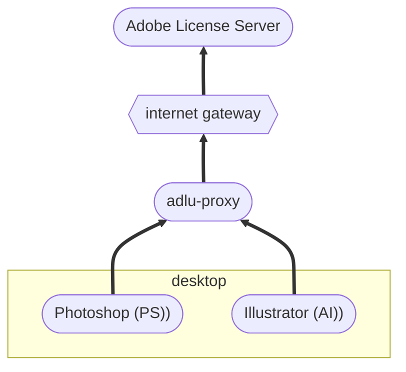
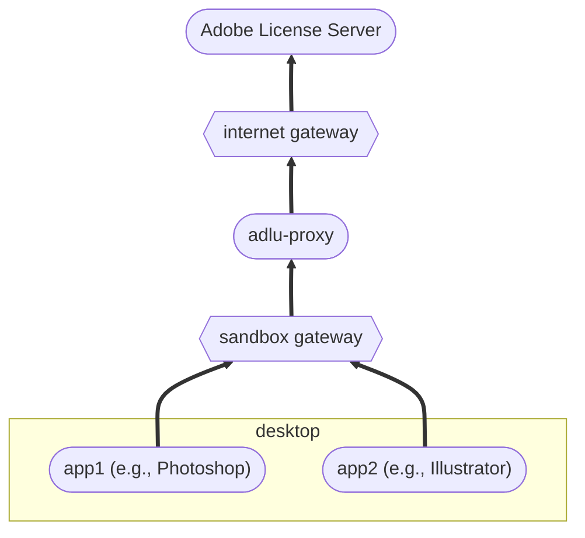
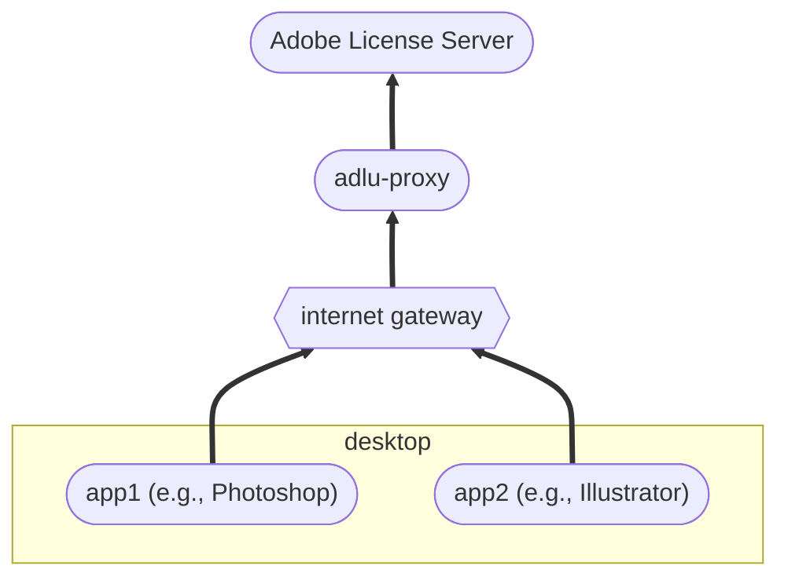

# ADLU Proxy Overview

The ADLU includes a web service, `adlu-proxy`, that is meant to be deployed on a customer-controlled server.  This document gives an overview of the proxy’s behavior and how it can be used effectively in various customer situations.

## Proxy characteristics

The ADLU proxy is a protocol-aware, caching, store-forward, reverse proxy server for both the Adobe License Server and the Adobe Log Server.  That’s a lot of adjectives in front of the word proxy; let’s consider each of them in turn.

### Protocol-aware

A _protocol-aware_ proxy server knows how to participate in the protocol exchanges that it proxies.  That is, it can understand what clients are sending to the server, and understand what the server responses mean to those clients.  This protocol awareness is what allows the proxy to provide its extended set of services.

### Caching

A _caching_ proxy server is a protocol-aware server that stores responses to earlier requests and returns them to later requests.  In order to do this, the proxy must understand the protocol well enough to know whether a stored response from an earlier request can be used as a valid response to a later request.

Of the three protocols understood by the ADLU proxy—named-user licensing, feature-restricted licensing, and license log uploading—only feature-restricted licensing responses can be cached.  The named-user licensing protocol is designed to prevent caching, and there is no content to the responses for log uploads (so there is nothing to cache).

### Store-forward

A _store-forward_ proxy server is a caching proxy that, when the server is offline, stores client requests until the server comes online, at which point it forwards them.  While the original client request goes unanswered, the proxy’s later forward of the request gets a response that the proxy then caches, so that later client requests of the same type will receive the cached response even if the server has again gone offline.

There are two modes in which store-forward proxies can operate:

* *Manual Forwarding*. In this mode, the proxy is explicitly told when to forward stored requests.
* _Automatic Forwarding_. In this mode, whenever the proxy detects that a client request has reached the server, it forwards any requests stored while the server was offline.

Which mode is appropriate typically depends on the network environment in which a store-forward proxy is deployed.  On a single, intermittently-connected network, then automatic forwarding can work well.  But on a fully isolated network, it is often more convenient to use manual forwarding and to trigger the forward while the proxy is temporarily moved to a connected network.

### Reverse

A *reverse* proxy server pretends to be an origin server by proxying all client requests to some origin server.  That is, clients send requests to the reverse proxy believing it is the origin server, the proxy replays those requests against the origin server so as to get a response, and then the proxy returns the response to the original client.

The ADLU proxy can act as a reverse proxy for either the Adobe License Server, the Adobe Log Server, or both at the same time.  Because it can recognize the client protocol directly from the request, it does not need different virtual hosts for licensing and log traffic.  All clients can be directed at the adlu-proxy instance at a single network endpoint.

## Deployment Scenarios

The ADLU proxy is typically deployed on the customer side of an internet gateway; that is, inside the customer local-area or corporate-area network.  Referring to the [simplest scenario in the Adobe Licensing Overview](./primer.md#launch-time-licensing), the proxy would be positioned as follows:

For customers who place sandbox networks between their corporate LAN and the internet, the ADLU proxy is typically deployed in their sandbox, as in this figure:

This placement of the proxy in the sandbox allows for it to be used by external as well as internal corporate clients, and also makes it easy to do internal-network DNS manipulation without it affecting the proxy.

For customers who don’t have the ability to host services in their internal network, the ADLU proxy can also be deployed as a hosted internet service, as in this diagram:

All of the deployment scenarios described below can work with any of these ADLU proxy placements.  But there can be differences in how each placement needs to be configured that depend on the protocol being proxied.  These are explained below.

### Feature-restricted licensing deployments

When administrators prepare FRL license packages, they can configure the endpoint that clients use to contact the Adobe License Server.  Because of this, they can assign a dedicated DNS name to the ADLU proxy deployment that is in their corporate domain, and all package clients will use it whether the client or the proxy is inside or outside the corporate firewall.  All of the scenarios in this section assume that a dedicated DNS name has been assigned and used in the FRL license packages.  For configuration information without the use of a dedicated proxy DNS name, see the scenarios for named-user licensing.

#### Multiple OS accounts in an intermittently connected network

It is common in FRL environments for each desktop to be used by multiple people (e.g. shift workers), each of whom has their own OS account.  Without the use of the ADLU proxy, this can be a problematic situation, because each time one a different OS user launches an app for the first time, he must be able to contact the server to obtain a license for that app.

Once an ADLU proxy instance is deployed in this environment, however, first-time users have no problems, because the license response from the server that was retrieved for one OS user can be reused by the proxy when the new OS users launches an app.  The proxy in this case should be run in _connected_ mode, so that it always tries to retrieve a license from the server, but will fall back to its cache if the server is unavailable.  Whenever a new desktop, or a new license for an existing desktop, is deployed, the administrator doing the deployment should be sure to launch each app while the network is online.  After that new users can be added to the machine whether the network is online or not.

#### Contractual or regulatory isolated networks

It’s very common in post-production and financial environments for contracts or regulations to mandate that desktop users have no access to the internet.  There are two variations of this scenaro, both of which can be managed using the ADLU Proxy.

* _Fully Isolated_. In this scenario, the network must be fully isolated while contract work is going on.  So all of the application licensing must take place before any contract work starts.  This situation is a variation of the [intermittent connectivity](#multiple-os-accounts-in-an-intermittently-connected-network) situation described above, and is handled the same way: during the setup phase, administrators who install applications must launch them, and an ADLU proxy instance on the network is used to keep those machines running once the network is disconnected.
* _Allow-listed clients/services_.  In this scenario, all connection attempts from the network must pass through a firewall which only allows contact from specific clients to specific services.  In this case, either the proxy is listed as the only allowed service, or the proxy is placed on the LAN and it is the sole client allowed to contact the Adobe License Server.

#### Fully isolated networks

High security networks are sometimes “air gapped” completely, so that all data that leaves the network must do so via media.  In this case, two instances of the ADLU proxy are used: one on the network in _isolated_ mode, whose job is just to collect client licensing requests, and one on a connected network which is used only to forward licensing requests and collect responses.  From time to time, the collected requests on the isolated network are exported to a file which is then transferred via “sneaker net” to the proxy machine on the connected network.  The connected proxy then replays the requests to the Adobe License Server, and the collected responses are exported to a file and transferred via “sneaker net” back to the proxy on the isolated network.

#### License controls on all networks

There can be advantages to using the ADLU Proxy even in fully connected network situations.  Because the creation of FRL packages allows creating combined packages (which have both licenses and applications in them), many customers :

- each machine needs _one_ license package for *all*  versions of each application.
- each machine needs _one_ application package for _each_ version of each application.

Customers who make combination packages end up with multiple licenses for each application—one for each version that was installed—and those multiple licenses will each activate separately, making it almost impossible to deactivate the machine
